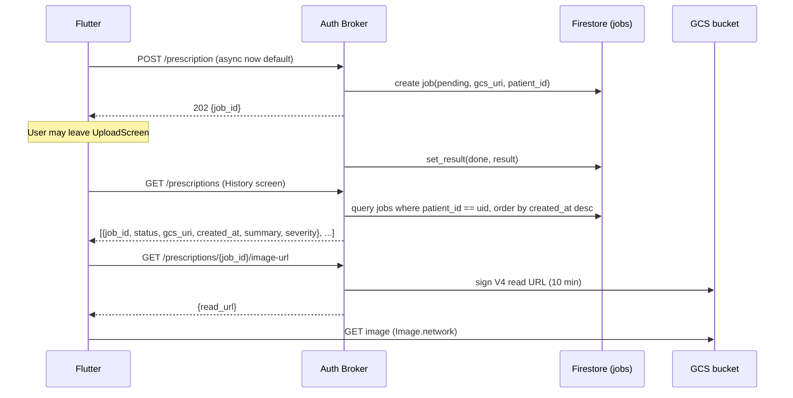

## Goal

1. Add a **History** screen that lists past prescription analyses (with thumbnail of the original image, severity badge, date, language) and opens the full `ResultScreen` on tap.
2. Solve "user leaves in-progress screen": rely on History — the in-flight job appears at the top with a `processing` chip and converts to a tappable, completed entry once the backend finishes. No global banner, no FCM.

## Architecture



## Backend changes

All in [`backend/auth_broker/`](backend/auth_broker/). No schema migration needed — the existing `jobs` Firestore collection already stores `patient_id`, `gcs_uri`, `language`, `status`, `result`, `created_at`, `updated_at`.

- **Async-only.** No production users yet, so collapse to a single code path: flip `ASYNC_PRESCRIPTION` default to `true` in [`backend/auth_broker/main.py`](backend/auth_broker/main.py) and `.env.example`, delete the `if ASYNC_PRESCRIPTION:` guard at line 263, and drop the sync branch entirely. Remove [`backend/auth_broker/prescription_handler.py`](backend/auth_broker/prescription_handler.py) and its tests if nothing else imports `run_sync_prescription`.
- **New endpoint `GET /prescriptions`** in [`backend/auth_broker/main.py`](backend/auth_broker/main.py):
  - Auth: Firebase JWT (existing middleware), `patient_id = request.state.patient_id`.
  - Query: Firestore `jobs` where `patient_id == uid`, order by `created_at desc`, limit 50 (param `?limit=`, `?cursor=` for pagination — keep simple, no cursor in v1).
  - Response: `{items: [PrescriptionHistoryItem]}` with `job_id`, `status`, `created_at`, `language`, `gcs_uri` (raw `gs://` — not consumed by client directly), and a thin projection of the result: `severity_max`, `drug_count`, `summary_one_liner`. Add `PrescriptionHistoryItem` to [`backend/schemas.py`](backend/schemas.py).
- **New endpoint `GET /prescriptions/{job_id}/image-url`** in `main.py`:
  - Verify ownership via `get_job_store().get_job(job_id)` → check `job.patient_id == uid` (same pattern as existing `GET /jobs/{job_id}`).
  - Use existing `auth_broker/gcs.py` helpers; add `create_read_url(gcs_uri, expires=600)` that returns a V4-signed GET URL via `Blob.generate_signed_url(method="GET")`.
  - Response: `{read_url, expires_in_seconds: 600, content_type}`.
- **Firestore composite index**: add `(patient_id ASC, created_at DESC)` to `firestore.indexes.json` (or document the manual creation in [`docs/deployment_runbook.md`](docs/deployment_runbook.md)).
- **`MemoryJobStore`**: add `list_jobs(patient_id, limit)` for tests/local dev, returning sorted in-memory docs.
- **Tests**: add `backend/tests/test_history_endpoints.py` covering: list returns only own jobs, list orders by recency, image-url denies foreign job_id, image-url 404 on missing job.

## Frontend changes

All in [`frontend/lib/`](frontend/lib/).

- **Models** — new [`frontend/lib/models/prescription_history_item.dart`](frontend/lib/models/prescription_history_item.dart) mirroring `PrescriptionHistoryItem` from the broker. Reuse `PrescriptionResult.fromJson` for the full payload returned by `GET /jobs/{job_id}`.
- **ApiService** — extend [`frontend/lib/services/api_service.dart`](frontend/lib/services/api_service.dart):
  - `Future<List<PrescriptionHistoryItem>> listPrescriptions({int limit=50})`
  - `Future<PrescriptionResult> getPrescriptionResult(String jobId)` (reuse existing `GET /jobs/{job_id}` path; map `job.result` → `PrescriptionResult`).
  - `Future<String> getPrescriptionImageUrl(String jobId)`.
  - Drop the sync path: remove the `ASYNC_PRESCRIPTION` dart-define from [`frontend/lib/config.dart`](frontend/lib/config.dart) and the 200-response branch in `analyzePrescription`; the client always does 202 → poll.
- **New screen** [`frontend/lib/screens/history_screen.dart`](frontend/lib/screens/history_screen.dart):
  - `FutureBuilder` / `ChangeNotifier` over `ApiService.listPrescriptions()`.
  - `ListView` of cards: leading = `Image.network(signedReadUrl)` thumbnail (cached via `cached_network_image` — add to `pubspec.yaml`), title = `summary_one_liner`, subtitle = formatted date + language flag, trailing = severity chip or `processing…` chip when `status != done`.
  - Pull-to-refresh.
  - Tap on `done` item: fetch full result via `getPrescriptionResult(job_id)` → `context.push('/result', extra: result)`.
  - Tap on `processing`/`pending` item: navigate to a lightweight in-progress view that polls `GET /jobs/{job_id}` until done (extracted from current `UploadScreen` polling logic into a small `PrescriptionJobWaiter` widget so both screens can share it).
- **Route** — add `/history` in [`frontend/lib/main.dart`](frontend/lib/main.dart) `GoRouter` config.
- **Home entry** — in [`frontend/lib/screens/home_screen.dart`](frontend/lib/screens/home_screen.dart) add a secondary button "History" / "Past prescriptions" below "Analyse prescription". Localize the label.
- **ResultScreen** — in [`frontend/lib/screens/result_screen.dart`](frontend/lib/screens/result_screen.dart), if the result is opened from History (carry an optional `jobId`), show the prescription image at the top via the signed read URL, collapsible.
- **Localisation** — add new strings (`historyTitle`, `historyEmpty`, `pastPrescriptionsButton`, `analysisInProgress`) to all ARB files under `frontend/lib/l10n/`.

## What this does NOT add

- No FCM push notifications, no in-app banner, no global "job tracker" provider. The History list is the single recovery surface.
- No client-side caching/offline DB — the History list always re-queries the broker. (Trivial to layer in later via `cached_network_image` + the list response.)
- No image download / share / delete actions in v1.
- No pagination cursor — flat `limit=50` is enough for a capstone-scale dataset.

## Pre-deploy: record rollback target

Run once before the first deploy of this branch and save the output. Currently deployed broker is `ASYNC_PRESCRIPTION=false` (verified via `/health` and direct Cloud Run env inspection), so this revision is the one-command rollback target if anything breaks post-cutover:

```bash
# capture current (sync) broker revision name + image
gcloud run services describe medication-companion-broker \
  --project=medication-companion-dev --region=us-central1 \
  --format='value(status.latestReadyRevisionName)'

# one-command rollback (sub-minute)
gcloud run services update-traffic medication-companion-broker \
  --project=medication-companion-dev --region=us-central1 \
  --to-revisions=<saved-revision-name>=100

# pair with frontend rollback (no rebuild)
firebase hosting:rollback --project medication-companion-dev
```

## Runbook cleanup (part of `be_async_default`)

In [`docs/deployment_runbook.md`](docs/deployment_runbook.md):
- Drop the now-dead "Enable async responses" step at lines 136-140 (the `ASYNC_PRESCRIPTION=true` cutover).
- Update line 129 comment from "ASYNC_PRESCRIPTION=false — sync default" to reflect that async is the only path.
- Update the env-var table at line 209 to remove the `ASYNC_PRESCRIPTION` row.

In [`Makefile`](Makefile):
- Remove `ASYNC_PRESCRIPTION ?= false` at lines 106 and 131 and the corresponding `--dart-define` / env-var plumbing.

In [`deploy/auth_broker/deploy.sh`](deploy/auth_broker/deploy.sh):
- Remove the `ASYNC_PRESCRIPTION="${ASYNC_PRESCRIPTION:-false}"` default at line 32, the echo at line 58, and drop the env from `--update-env-vars` at line 90.

In [`docs/smoke_test_cheatsheet.md`](docs/smoke_test_cheatsheet.md):
- Remove any references to toggling `ASYNC_PRESCRIPTION` between sync and async.

## Risks / call-outs

- **Cutover is real on first deploy.** Broker flips from sync (verified live) to async-only. Worker + Pub/Sub topic + Firestore are already deployed and healthy (verified via `gcloud run services list` and `gcloud pubsub topics describe`), so risk is bounded to "is the worker actually processing messages today?" — answer that with one end-to-end smoke immediately after deploy (see Smoke section below).
- **Smoke after deploy:** `curl /health` shows `async_prescription: true` (or whatever the response is once the field is removed); upload one prescription from the app; tail worker logs:
  ```bash
  gcloud beta run services logs read medication-companion-prescription-worker \
    --project=medication-companion-dev --region=us-central1 --limit=50
  ```
- **Signed-URL lifetime.** 10 min covers normal browsing; if a user keeps the History screen open longer the `Image.network` requests will 403. Refresh on `RefreshIndicator` is fine for v1.
- **Bucket access uniformity.** `auth_broker/gcs.py` already signs PUT URLs with a service-account key/IAM; reuse the same signer for GET. No bucket ACL changes.
- **AGENTS.md hard rule #3** (no prescription images in memory) is unchanged — images stay in GCS; we never cache bytes server-side.
