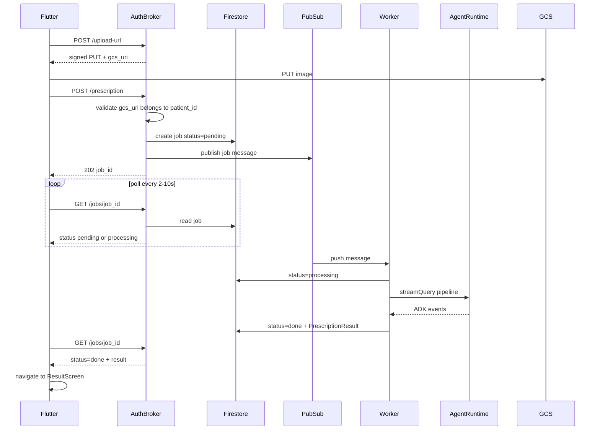
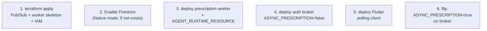

# Pub/Sub-backed prescription analysis

## Your Firestore vs generic-client question

**Firestore is the job store (backend persistence). `GET /jobs/{job_id}` is the canonical client contract.**

| Layer | Role | Who uses it |
|-------|------|-------------|
| Firestore `jobs/{job_id}` | Durable state written by broker + worker | Auth broker (read), worker (write) |
| `GET /jobs/{job_id}` | Stable HTTP API returning job status + `PrescriptionResult` | Flutter, CLI (`scripts/test_prescription.py`), future MCP tools, any HTTP client |
| Firestore snapshot listener (optional, v2) | Flutter-only latency optimization | Flutter only — never required |

A future MCP integration would call `POST /prescription` → `202 {job_id}` and poll `GET /jobs/{id}` (or long-poll if added later). It would **not** need the Firestore SDK. Adding a Flutter Firestore listener later does not remove or change the HTTP API.

**v1 recommendation:** Flutter polls `GET /jobs/{job_id}` with exponential backoff (2s → 5s → 10s, cap ~90s). No `cloud_firestore` dependency in v1. Design job documents and broker responses so a v2 Firestore listener or FCM push can be layered on without schema changes.



---

## Endpoint impact matrix

| Endpoint | Auth | Today | After change |
|----------|------|-------|--------------|
| `GET /health` | None | Unchanged | Unchanged |
| `POST /upload-url` | Firebase JWT | Issues `prescriptions/{uuid}.ext` | **Change path** to `prescriptions/{patient_id}/{uuid}.ext` ([`backend/auth_broker/gcs.py`](backend/auth_broker/gcs.py) line 106) |
| `PUT` signed GCS URL | Signed URL | Client uploads bytes | **Unchanged** |
| `POST /upload-direct` | Firebase JWT (local only) | Already uses `prescriptions/{patient_id}/…` | **Unchanged** |
| `POST /prescription` | Firebase JWT | Sync `200` + `PrescriptionResult` (~20–40s) | **Default async:** `202` + `{job_id, status:"pending"}`; **no Agent Runtime call on request thread**. Optional sync fallback behind `SYNC_PRESCRIPTION=true` or `?sync=true` during migration |
| `GET /jobs/{job_id}` | Firebase JWT | Does not exist | **New.** Returns job status; includes `result: PrescriptionResult` when `done`, `error` when `failed`/`gate1_reject` |
| Firebase Hosting rewrites | — | `/upload-url`, `/upload-direct`, `/prescription`, `/health` | **Add** `/jobs/**` → broker ([`firebase.json`](firebase.json)) |

### Validation added to `POST /prescription`

Before enqueue (and on sync path):

1. `gcs_uri` starts with `gs://` (existing)
2. **New:** path segment after `prescriptions/` must equal `request.state.patient_id` (path-based binding per your choice)
3. `content_type` MIME check (existing)

### Error semantics in async model

| Condition | HTTP on enqueue | Job terminal state |
|-----------|-----------------|-------------------|
| Invalid `gcs_uri` / wrong patient path | `400` immediately | N/A (no job created) |
| Gate 1 reject (unreadable image) | `202` (job created) | `status=failed`, `error.code=gate1_reject` — Flutter maps to existing `RetakeRequiredException` UX |
| Pipeline failure | `202` | `status=failed`, `error.code=pipeline_error` |
| Success | `202` | `status=done`, `result` = same `PrescriptionResult` shape as today ([`backend/schemas.py`](backend/schemas.py)) |

`GET /jobs/{id}` returns `403` if `job.patient_id != JWT patient_id`.

---

## Backend components (new / changed)

### 1. Schemas — [`backend/schemas.py`](backend/schemas.py)

Add:

```python
class JobError(BaseModel):
    code: Literal["gate1_reject", "pipeline_error", "internal_error"]
    message: str
    reason: str | None = None  # gate1 only

class PrescriptionJobStatus(BaseModel):
    job_id: str
    status: Literal["pending", "processing", "done", "failed"]
    created_at: str
    updated_at: str
    result: PrescriptionResult | None = None
    error: JobError | None = None
```

Pub/Sub message schema (versioned): `{ "schema_version": 1, "job_id", "patient_id", "gcs_uri", "language", "content_type" }`.

### 2. Job store — new [`backend/auth_broker/job_store.py`](backend/auth_broker/job_store.py)

- Firestore collection `jobs/{job_id}`
- Fields: `patient_id`, `status`, `gcs_uri`, `language`, `content_type`, `result` (JSON), `error`, timestamps
- Methods: `create_job()`, `get_job()`, `update_status()`, `set_result()`, `set_failed()`
- **Idempotency:** worker checks `status != pending` before processing; skip if already `processing`/`done` (Pub/Sub at-least-once)
- Local dev: `JOB_STORE_BACKEND=firestore` (default prod) or `JOB_STORE_BACKEND=memory` for unit tests (no emulator required)

### 3. Auth broker changes — [`backend/auth_broker/main.py`](backend/auth_broker/main.py)

- Extract GCS ownership check to [`backend/auth_broker/gcs.py`](backend/auth_broker/gcs.py): `assert_gcs_uri_owned_by_patient(gcs_uri, patient_id)`
- `POST /prescription`: create Firestore job → publish Pub/Sub → return `202`
- `GET /jobs/{job_id}`: read Firestore, enforce patient ownership, return `PrescriptionJobStatus`
- Keep existing sync assembly path in [`backend/auth_broker/assembly.py`](backend/auth_broker/assembly.py) — worker reuses it

### 4. Pub/Sub publisher — new [`backend/auth_broker/pubsub_client.py`](backend/auth_broker/pubsub_client.py)

- `publish_prescription_job(message)` with `job_id` as ordering key (optional)
- Local: `PUBSUB_BACKEND=inline` runs worker coroutine via `asyncio.create_task` after 202 (convenience for `make local-auth-broker` without a second process); production uses real Pub/Sub

### 5. Worker — new [`backend/workers/prescription_worker.py`](backend/workers/prescription_worker.py)

- Cloud Run service with Pub/Sub **push** subscription (HTTP `POST /` handler) or pull subscriber
- On message: mark `processing` → call existing [`run_prescription_pipeline`](backend/auth_broker/agent_client.py) → reuse gate1/assembly logic from [`main.py`](backend/auth_broker/main.py) lines 233–266 → write `done` or `failed`
- DLQ topic + alert on poison messages (3 retries)
- **Separate deploy target:** `deploy/workers/deploy.sh` + `make deploy-prescription-worker` (do not fold into `make local-auth-broker` per [`AGENTS.md`](AGENTS.md))

### 6. Infrastructure — new [`deployment/terraform/single-project/pubsub.tf`](deployment/terraform/single-project/pubsub.tf)

- Topic `prescription-jobs`
- Push subscription → worker Cloud Run URL
- Dead-letter topic + subscription
- IAM: broker SA → `roles/pubsub.publisher`; worker SA → `roles/pubsub.subscriber`, `roles/datastore.user` (Firestore), `roles/aiplatform.user`
- Env vars on broker: `PUBSUB_TOPIC`, `FIRESTORE_PROJECT`; on worker: `PUBSUB_SUBSCRIPTION`, same Firestore + `AGENT_RUNTIME_RESOURCE`

### 7. Firestore security rules — [`deploy/firestore.rules`](deploy/firestore.rules)

Stub today. For v1 (broker-only reads): rules can deny all client access (`allow read, write: if false`) since Flutter polls HTTP, not Firestore.

For v2 Flutter listener: `allow read: if request.auth.uid == resource.data.patient_id` on `jobs/{jobId}`.

---

## Flutter changes

### [`frontend/lib/services/api_service.dart`](frontend/lib/services/api_service.dart)

Split `analyzePrescription()`:

1. `uploadPrescriptionImage()` — steps 1–2 unchanged (upload-url + GCS PUT / upload-direct fallback)
2. `enqueuePrescription(gcsUri, language, contentType)` → `POST /prescription`, expect `202`, parse `job_id`
3. `getJobStatus(jobId)` → `GET /jobs/{jobId}`
4. `waitForPrescriptionResult(jobId)` — poll with backoff until `done`/`failed`; map `gate1_reject` → `RetakeRequiredException`

### New model — `frontend/lib/models/prescription_job.dart`

Mirror `PrescriptionJobStatus` from backend.

### [`frontend/lib/screens/upload_screen.dart`](frontend/lib/screens/upload_screen.dart)

- After upload, enqueue then poll (replace 120s blocking POST)
- Show real status text: "Queued…" / "Analysing…" based on `job.status`
- Shorter enqueue timeout (30s); poll window up to ~90s
- Optional: persist `job_id` in `shared_preferences` to survive app backgrounding (stretch; can defer)

### [`firebase.json`](firebase.json)

Add rewrite for `/jobs/**`.

### [`frontend/lib/screens/result_screen.dart`](frontend/lib/screens/result_screen.dart)

No changes — still receives `PrescriptionResult` via router `extra`.

---

## Local dev and testing

| Mode | Broker | Worker | Job store |
|------|--------|--------|-----------|
| Unit tests | `JOB_STORE_BACKEND=memory`, `PUBSUB_BACKEND=inline` | inline task | in-memory |
| `make local-auth-broker` | real or inline Pub/Sub | `PUBSUB_BACKEND=inline` (default local) | Firestore emulator or memory |
| Production | Cloud Run broker | Cloud Run worker (separate service) | Firestore |

**Tests to add:**

- [`tests/unit/test_auth_broker.py`](tests/unit/test_auth_broker.py): GCS path binding (patient B cannot enqueue patient A's URI); `202` response; `GET /jobs` ownership
- New `tests/unit/test_job_store.py`: idempotent status transitions
- New `tests/unit/test_prescription_worker.py`: mock pipeline → Firestore `done`/`failed`
- Update [`scripts/test_prescription.py`](scripts/test_prescription.py): poll loop after enqueue

**Specs:** Add scenario to [`specs/pipeline.feature`](specs/pipeline.feature) for async enqueue + poll; update [`deploy/auth_broker/README.md`](deploy/auth_broker/README.md) endpoint table.

---

## Migration strategy

Phased rollout uses **`ASYNC_PRESCRIPTION`** on the auth broker: both sync and async
code paths live in the same `POST /prescription` handler; the flag selects behavior.
Default **`false`** through Phase A and B so Flutter keeps working unchanged.

| Phase | Scope | `ASYNC_PRESCRIPTION` | Flutter |
|-------|--------|----------------------|---------|
| **A** | GCS binding, job store, Pub/Sub + worker, `GET /jobs/{id}`, broker dual path | `false` (default) | Unchanged (sync `200`) |
| **B** | Flutter enqueue + poll | `false` until ready | Polling client shipped |
| **C** | Cutover | `true` | Must use Phase B client |
| **D** | Remove sync fallback | `true` | Polling only |

### Phase A deliverables (backend only)

1. Path-based GCS binding on `/upload-url` + validation on `/prescription`
2. `PrescriptionJobStatus` schemas + Firestore/memory job store
3. Pub/Sub publisher + push worker → `run_prescription_pipeline`
4. `POST /prescription` async branch (flag off by default) + `GET /jobs/{job_id}`
5. Terraform Pub/Sub + worker skeleton, `firebase.json` `/jobs/**` rewrite
6. Unit tests (binding, job store, async path with flag on)

1. **Phase A (backend, flag off):** GCS path binding + Firestore job store + worker + `GET /jobs` — deploy worker; broker still sync by default (`ASYNC_PRESCRIPTION=false`)
2. **Phase B (Flutter):** Ship polling client; feature-flag async in Flutter config
3. **Phase C (cutover):** Set `ASYNC_PRESCRIPTION=true` in prod broker; keep sync fallback 1–2 releases via env flag
4. **Phase D (cleanup):** Remove sync path once Flutter + scripts migrated

---

## Observability

- Structured log fields: `job_id`, `patient_id` (hashed in prod if needed), `status` at broker publish, worker start, worker complete
- Propagate `job_id` into existing telemetry in [`backend/app_utils/telemetry.py`](backend/app_utils/telemetry.py)
- Cloud Trace: link broker span → Pub/Sub → worker span (W3C trace context in message attributes)

---

## Impact analysis — production code

### What does NOT change (zero or minimal risk)

| Component | Why unaffected |
|-----------|----------------|
| **Agent Runtime** ([`backend/agent.py`](backend/agent.py), [`backend/agent_runtime_app.py`](backend/agent_runtime_app.py)) | Pipeline agents, tools, memory, guardrails unchanged. Worker invokes the same `streamQuery` path via [`agent_client.py`](backend/auth_broker/agent_client.py). |
| **Agent deploy** (`make deploy`, `agents-cli deploy`) | Same artifact, same env vars (`MEMORY_BACKEND=vertex`, `DRUGS_DB_GCS_URI`, telemetry). No new Runtime dependencies. |
| **GCS PUT (signed URL)** | Client still uploads bytes directly to GCS; only the object path prefix changes. |
| **Legacy Cloud Run** ([`deploy/legacy_cloud_run/`](deploy/legacy_cloud_run/)) | Archived; not in prod path. |
| **Staging load test** ([`tests/load_test/load_test.py`](tests/load_test/load_test.py)) | Hits Agent Runtime `streamQuery` directly with a text prompt — not the auth broker `/prescription` path. |
| **CI unit tests** ([`.github/workflows/ci.yml`](.github/workflows/ci.yml)) | Run with `MEMORY_BACKEND=local`, mocked broker — unaffected unless new tests added. |

### What changes — by production surface

#### 1. Auth broker (Cloud Run `medication-companion-broker`)

**Files:** [`backend/auth_broker/main.py`](backend/auth_broker/main.py), [`gcs.py`](backend/auth_broker/gcs.py), new `job_store.py`, `pubsub_client.py`

| Aspect | Before | After |
|--------|--------|-------|
| `/prescription` latency | 20–40s (blocks on Runtime) | &lt;1s (Firestore write + Pub/Sub publish) |
| Runtime dependency | Every request | **None** on request thread when `ASYNC_PRESCRIPTION=true` |
| Memory/CPU pressure | Holds connection + streams SSE | Lightweight; can reduce perceived timeout risk |
| Env vars (new) | `AGENT_RUNTIME_RESOURCE` only (dynamic) | + `PUBSUB_TOPIC`, `ASYNC_PRESCRIPTION`, `FIRESTORE_PROJECT` |
| IAM (new) | `storage.admin`, `aiplatform.user`, signBlob | + `roles/pubsub.publisher`, + `roles/datastore.user` |

**Breaking change (GCS binding):** `/upload-url` paths change from `prescriptions/{uuid}.ext` → `prescriptions/{patient_id}/{uuid}.ext`. Existing objects at the old path remain in GCS but **cannot be enqueued** after cutover (validation rejects). No migration of old blobs needed — only new uploads use the new path.

**Eval/smoke GCS objects** under `eval/` prefix (e.g. `gs://…/eval/smoke_4drug_2interactions.png`) are **not** under `prescriptions/` — binding check must scope to `prescriptions/` only so eval fixtures are unaffected.

#### 2. New prescription worker (Cloud Run `medication-companion-prescription-worker`)

**New service** — separate from broker per [`AGENTS.md`](AGENTS.md).

| Setting | Recommended | Rationale |
|---------|-------------|-----------|
| Timeout | **300s** (or max 3600s) | Pipeline is 20–40s; headroom for cold start + retries |
| Memory | **1Gi** | Same image family as broker + ADK event buffering |
| CPU | **1–2** | Matches Agent Runtime client workload |
| Concurrency | **1–4** | Limit parallel Runtime calls per instance |
| Ingress | **Internal** (push from Pub/Sub) | Not client-facing |
| Auth | Pub/Sub push OIDC → worker | `roles/run.invoker` for `service-{project}@gcp-sa-pubsub.iam.gserviceaccount.com` |

**Deploy:** New `deploy/workers/deploy.sh` + CI step after `deploy-auth-broker`. Worker needs `AGENT_RUNTIME_RESOURCE` (same as broker today).

#### 3. Firebase Hosting ([`firebase.json`](firebase.json))

- Add rewrite: `/jobs/**` → `medication-companion-broker`
- Redeploy hosting with Flutter build (existing staging/prod workflows)

#### 4. Flutter web app ([`frontend/`](frontend/))

- [`api_service.dart`](frontend/lib/services/api_service.dart): split upload / enqueue / poll
- [`upload_screen.dart`](frontend/lib/screens/upload_screen.dart): async UX
- **Must ship before or with** `ASYNC_PRESCRIPTION=true` in prod — old client expects `200` + `PrescriptionResult`, new API returns `202` + `job_id`

#### 5. CI/CD workflows

| Workflow | Change needed |
|----------|---------------|
| [`.github/workflows/staging.yaml`](.github/workflows/staging.yaml) | Add `terraform apply` for Pub/Sub (or one-time manual `make infra-apply`); add **Deploy prescription worker** step; broker deploy script passes new env vars |
| [`.github/workflows/deploy-to-prod.yaml`](.github/workflows/deploy-to-prod.yaml) | Same as staging |
| [`.github/workflows/ci.yml`](.github/workflows/ci.yml) | No change unless adding integration tests |
| [`deploy/auth_broker/deploy.sh`](deploy/auth_broker/deploy.sh) | Extend `--update-env-vars` with `PUBSUB_TOPIC`, `ASYNC_PRESCRIPTION`, `FIRESTORE_PROJECT` |

#### 6. Operational runbooks

Update: [`docs/deployment_runbook.md`](docs/deployment_runbook.md), [`docs/smoke_test_cheatsheet.md`](docs/smoke_test_cheatsheet.md), [`deploy/auth_broker/README.md`](deploy/auth_broker/README.md)

New failure modes to document:

- Job stuck `pending` → Pub/Sub publish failure or worker down
- Job stuck `processing` → worker crash mid-pipeline (needs timeout + `failed` sweep)
- DLQ messages → poison payload or repeated Runtime 500

#### 7. Makefile

- Keep `make local-auth-broker` HTTP-only; document `PUBSUB_BACKEND=inline` for local async without second process
- Add `make deploy-prescription-worker` (parallel to `deploy-auth-broker`)

### Production deploy order (safe rollout)



Steps 1–4 are backward-compatible: sync `/prescription` still works until step 6.

---

## Impact analysis — eval pipelines

### Summary: eval is largely decoupled from the HTTP async path

The quality/eval stack runs **inside Agent Runtime** or **bypasses HTTP entirely**. Moving enqueue to Pub/Sub does not change how agents execute or how judges score output.

### Eval path inventory

| Path | Entry point | Touches auth broker? | Impact |
|------|-------------|---------------------|--------|
| **Runtime async judge** | [`backend/agent.py`](backend/agent.py) `after_agent_callback` → [`schedule_pipeline_eval`](backend/evaluation/pipeline_eval.py) → [`llm_judge.py`](backend/evaluation/llm_judge.py) → BigQuery `eval_log` | No | **None.** Fires when worker calls `streamQuery` — same ADK session lifecycle as sync broker today. |
| **Vision eval trace** | [`scripts/run_vision_eval_trace.py`](scripts/run_vision_eval_trace.py) calls `run_prescription_pipeline()` directly | No | **None** for pipeline logic. Optional: add `--via-broker` mode later to test async HTTP end-to-end (not required for agent quality). |
| **agents-cli eval** | `agents-cli eval generate/grade/run` → Agent Runtime | No | **None.** Uses [`tests/eval/datasets/basic-dataset.json`](tests/eval/datasets/basic-dataset.json) with `gs://…/eval/…` URIs. |
| **Drug lookup eval** | [`backend/evaluation/drug_lookup_eval.py`](backend/evaluation/drug_lookup_eval.py), [`tests/unit/test_drug_lookup_eval.py`](tests/unit/test_drug_lookup_eval.py) | No | **None.** |
| **Pipeline eval unit tests** | [`tests/unit/test_pipeline_eval.py`](tests/unit/test_pipeline_eval.py) | No | **None.** |
| **Smoke script** | [`scripts/test_prescription.py`](scripts/test_prescription.py) → HTTP `/prescription` | **Yes** | **Update required** when async is default: handle `202`, poll `GET /jobs/{id}`, or pass `--sync` flag during transition. |
| **Capstone BDD** | [`specs/pipeline.feature`](specs/pipeline.feature) | Indirect | Add async scenario; agent scenarios unchanged. |

### Eval scores in API response

[`PrescriptionResult.eval_scores`](backend/schemas.py) exists in the schema but [`assemble_prescription_result`](backend/auth_broker/assembly.py) does **not** populate it today. The LLM judge writes to **BigQuery only**, asynchronously inside Runtime.

**Implication for async jobs:** `eval_scores` will remain `null` in `GET /jobs/{id}` result unless you later wire judge results back into Firestore (out of scope). BigQuery `eval_log` rows continue to appear ~seconds after job completes, queryable by `session_id` from the job result.

### Gate 1 and eval

Unchanged: [`pipeline_eval.py`](backend/evaluation/pipeline_eval.py) skips judge when Gate 1 rejects. In async model, Gate 1 surfaces as `job.status=failed`, `error.code=gate1_reject` — no BigQuery eval row (same as today).

### GCS path binding vs eval fixtures

| Prefix | Example | Binding rule |
|--------|---------|--------------|
| `prescriptions/{patient_id}/…` | Prod uploads | **Must match JWT `patient_id`** |
| `eval/…` | Smoke dataset, vision eval trace uploads | **Exempt** — not patient prescription data |
| `artifacts/drugs.db` | Deploy artifact | Unaffected |

---

## Terraform additions (Pub/Sub + worker + Firestore IAM)

### APIs to enable — [`deployment/terraform/single-project/apis.tf`](deployment/terraform/single-project/apis.tf)

Add to `locals.services`:

- `pubsub.googleapis.com`
- `firestore.googleapis.com` (if not already enabled via Firebase console)

Mirror in [`deployment/terraform/cicd/apis.tf`](deployment/terraform/cicd/apis.tf) for staging/prod projects.

### New file: `deployment/terraform/single-project/pubsub.tf`

(and mirror `deployment/terraform/cicd/pubsub.tf` with `for_each = local.deploy_project_ids`)

```hcl
# ── Pub/Sub: prescription analysis jobs ─────────────────────────────────────

resource "google_pubsub_topic" "prescription_jobs" {
  name    = "prescription-jobs"
  project = var.project_id
}

resource "google_pubsub_topic" "prescription_jobs_dlq" {
  name    = "prescription-jobs-dlq"
  project = var.project_id
}

resource "google_cloud_run_v2_service" "prescription_worker" {
  name     = "${var.project_name}-prescription-worker"
  # ... skeleton like auth_broker.tf: placeholder image, lifecycle ignore_changes
  # template.timeout = "300s"
  # template.containers.resources.limits = { cpu = "1", memory = "1Gi" }
  # ingress = "INGRESS_TRAFFIC_INTERNAL_ONLY"  # push-only
}

resource "google_pubsub_subscription" "prescription_jobs_push" {
  name  = "prescription-jobs-worker"
  topic = google_pubsub_topic.prescription_jobs.id

  push_config {
    push_endpoint = "${google_cloud_run_v2_service.prescription_worker.uri}/"
    oidc_token {
      service_account_email = google_service_account.app_sa.email
    }
  }

  dead_letter_policy {
    dead_letter_topic     = google_pubsub_topic.prescription_jobs_dlq.id
    max_delivery_attempts = 5
  }

  retry_policy {
    minimum_backoff = "10s"
    maximum_backoff = "600s"
  }

  ack_deadline_seconds = 300
}

# DLQ subscription for ops alerting / replay
resource "google_pubsub_subscription" "prescription_jobs_dlq_monitor" {
  name  = "prescription-jobs-dlq-monitor"
  topic = google_pubsub_topic.prescription_jobs_dlq.id
}
```

### IAM additions — [`deployment/terraform/single-project/iam.tf`](deployment/terraform/single-project/iam.tf) or inline in `pubsub.tf`

| Principal | Role | Purpose |
|-----------|------|---------|
| `app_sa` (broker + worker) | `roles/pubsub.publisher` | Broker publishes jobs |
| `app_sa` | `roles/datastore.user` | Firestore read/write (`jobs` collection) |
| `app_sa` | `roles/aiplatform.user` | Already granted — worker calls Runtime |
| `service-{project_number}@gcp-sa-pubsub.iam.gserviceaccount.com` | `roles/run.invoker` on worker | Pub/Sub push delivery |
| `app_sa` | `roles/iam.serviceAccountUser` on self (if push uses app_sa OIDC) | Token minting for push |

Add to `var.app_sa_roles` default **or** dedicated `google_project_iam_member` resources:

```hcl
"roles/pubsub.publisher",
"roles/datastore.user",
```

### Artifact Registry

Option A (simpler): second image tag in existing `${project_name}-broker` repo (`prescription-worker:tag`).

Option B: new repo `${project_name}-worker` — cleaner separation.

### Env vars (Terraform static + deploy script dynamic)

| Service | Terraform static | Deploy script dynamic |
|---------|------------------|----------------------|
| Auth broker | `PUBSUB_TOPIC=prescription-jobs`, `FIRESTORE_PROJECT`, `ASYNC_PRESCRIPTION=false` (flip via deploy) | `AGENT_RUNTIME_RESOURCE` (unchanged) |
| Worker | `GCS_BUCKET`, `FIREBASE_PROJECT_ID`, `FIRESTORE_PROJECT` | `AGENT_RUNTIME_RESOURCE` |

### Firestore database provisioning

**Not fully automatable in current repo today.** [`scripts/setup_gcp.sh`](scripts/setup_gcp.sh) documents manual Firebase console step: enable Firestore Native mode. Terraform can reference an existing default database via data source once created:

```hcl
# After first-time console enable:
data "google_firestore_database" "default" {
  project     = var.project_id
  name        = "(default)"
  database_id = "(default)"
}
```

Job documents: collection `jobs`, no composite indexes needed for v1 (lookup by doc ID only).

### Outputs — add to [`deployment/terraform/single-project/outputs.tf`](deployment/terraform/single-project/outputs.tf)

- `prescription_jobs_topic`
- `prescription_worker_url`
- `prescription_worker_service_name`

### What Terraform does NOT need (v1)

- FCM / Firebase Messaging resources
- Client-facing Firestore rules changes (deny-all is fine while Flutter polls HTTP)
- Changes to Agent Runtime Reasoning Engine resource
- BigQuery `eval_log` (separate BACKLOG item)

### Estimated `terraform apply` footprint

| Resource type | Count (single-project) | Count (cicd: staging + prod) |
|---------------|------------------------|------------------------------|
| `google_pubsub_topic` | 2 | 4 |
| `google_pubsub_subscription` | 2 | 4 |
| `google_cloud_run_v2_service` | 1 (worker) | 2 |
| `google_artifact_registry_repository` | 0–1 | 0–2 |
| `google_project_iam_member` | 2–3 | 4–6 |
| `google_cloud_run_v2_service_iam_member` | 1 (pubsub invoker) | 2 |

---

## Out of scope for v1 (document in BACKLOG)

- FCM push notification on job complete
- Flutter Firestore snapshot listener
- MCP tool surface (will use same HTTP job API when added)
- GCS lifecycle deletion rules (separate BACKLOG item)
