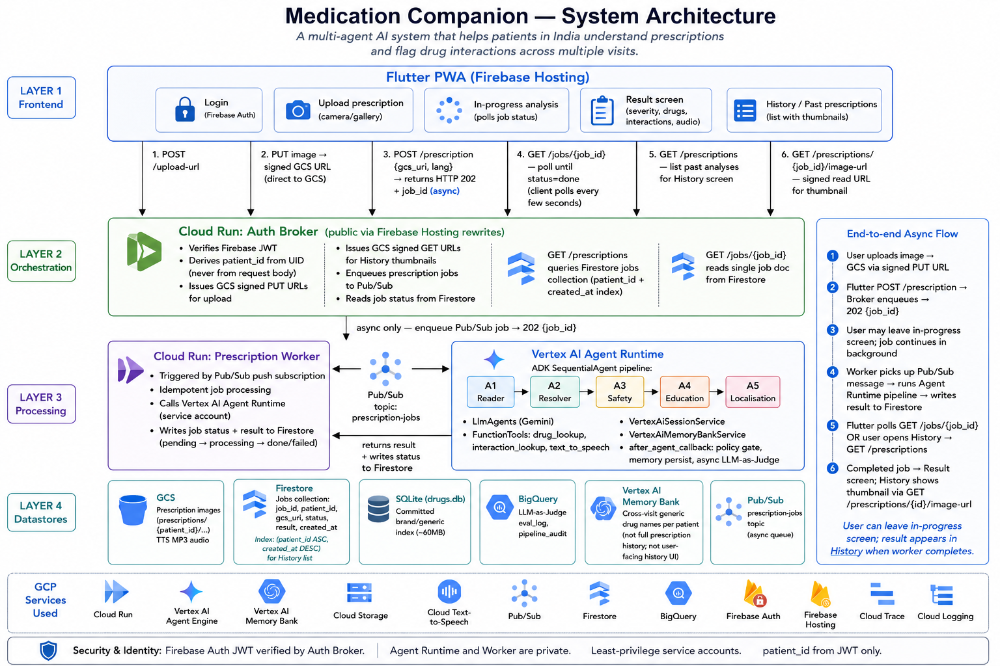

# Architecture — Medication Companion

## System overview



Medication Companion is a **multi-agent pipeline** built with Google ADK + Gemini.
Each agent has a single, bounded responsibility. Agents communicate via structured
Pydantic models through ADK session state — never plain dicts, never free text between agents.

The diagram above shows the production topology: Flutter PWA → auth broker → Pub/Sub →
prescription worker → Vertex AI Agent Runtime, with Firestore for job state and History,
plus the backing datastores and GCP services.

---

## Agent pipeline

```
Image upload
    │
    ▼
[Input Guardrail] ──(reject)──► HTTP 400 to patient
    │
    ▼
Agent 1: Prescription Reader
  • Gemini Vision extracts drug names
  • Assigns confidence score per name
  • Gate 1: any confidence < 0.75 → Gate1Reject → HTTP 422 to patient
    │
    ▼
Agent 2: Medication Resolver
  • Calls drug_lookup FunctionTool (RxNav API → India CSV fallback)
  • Calls combo_splitter FunctionTool for FDC products
  • Tags each drug NEW or EXISTING (checks Vertex AI memory)
    │
    ▼
Agent 3: Reconciliation & Safety
  • Reads current visit drugs from session state (Agent 2 output)
  • Reads prior visit drugs from Vertex AI MemoryBankService
  • LLM checks interactions: current × current AND current × prior
  • Outputs severity-tagged interaction list
    │
    ▼
Agent 4: Patient Education
  • Generates plain-language explanation calibrated to severity
  • Builds drug cards, interaction cards, doctor questions
  • Mandatory disclaimer injected
    │
    ▼
Agent 5: Localisation + Audio (in-process, same Agent Runtime)
  • Translates to patient language (hi-IN, ta-IN, te-IN, bn-IN, en-IN)
  • Calls GCP Text-to-Speech via FunctionTool
  • Uploads MP3 to Cloud Storage
  • Returns signed URL (24h expiry)
    │
    ▼
[after_agent_callback]
  • Output policy gate (strips diagnostic language, enforces disclaimer)
  • Persists visit to VertexAiMemoryBankService
  • Fires LLM-as-Judge asynchronously (non-blocking)
    │
    ▼
JSON response to Flutter PWA
```

> **Note — A2A is a future extension.** Agent 5 currently runs **in-process** inside
> the same `SequentialAgent` on Vertex AI Agent Runtime (`deployment_metadata.json`:
> `is_a2a: false`). An earlier prototype deployed Agent 5 as a separate Cloud Run
> service over A2A; that code is preserved under `deploy/legacy_cloud_run/` and may
> be revived if independent scaling of localisation/TTS becomes a need.

---

## Session state schema

```python
class SessionState(BaseModel):
    session_id: str
    patient_id: str              # Firebase UID — never trust client body
    visit_timestamp: datetime
    
    # Agent 1 output
    extracted_drugs: list[ExtractedDrug]
    gate1_passed: bool
    
    # Agent 2 output
    resolved_drugs: list[ResolvedDrug]
    
    # Agent 3 output
    interactions: list[Interaction]
    overall_severity: str
    
    # Agent 4 output
    education_output: EducationOutput
    
    # A2A response
    audio_url: str | None
    translated_text: str | None
```

---

## Memory architecture

| Type | Service | Scope | What is stored |
|------|---------|-------|----------------|
| Short-term | `VertexAiSessionService` | Single pipeline run | Session state above |
| Long-term | `VertexAiMemoryBankService` | Cross-visit per patient | Resolved generic names + visit timestamp + severity summary |

Memory is keyed by `patient_id` (Firebase UID). Isolation between patients is enforced
at the service level — the memory service wrapper validates the patient_id matches
the verified JWT before any read or write.

**What is never stored in memory:** prescription images, clinical notes, diagnosis text,
raw LLM output, PII beyond patient_id.

---

## LLM cost discipline

LLM calls in this system:
- Agent 1: one vision call per run (image analysis)
- Agent 2: one call + 1-2 tool calls (deterministic tools reduce LLM load)
- Agent 3: one call (reads structured session state — no re-processing)
- Agent 4: one call (reads structured Agent 3 output)
- Agent 5: one translation call + one TTS tool call
- LLM-as-Judge: two calls async (non-blocking, post-response)

Total per run: ~7 LLM calls. Agent 2's deterministic tools (RxNav, combo_splitter)
avoid LLM calls for the resolution step.

---

## Observability

- **Cloud Trace**: each agent is an OpenTelemetry named span. Full waterfall (Agent 1 → Agent 5) is visible as a single Agent Runtime trace.
- **Structured logging**: `google.cloud.logging` JSON format on both services. Guardrail rejections, memory writes, and judge scores are all logged with session_id.
- **BigQuery audit**: `medication_companion.eval_log` captures LLM-as-Judge scores per run. `medication_companion.pipeline_audit` captures latency and severity per run.
- **Health endpoints**: `GET /health` on both Cloud Run services.

---

## Security model

- Auth broker Cloud Run service: public, but every request must carry a valid Firebase JWT (verified at the FastAPI middleware layer).
- Vertex AI Agent Runtime and the Pub/Sub Prescription Worker are **private** — reached only via service-account credentials from the auth broker.
- `patient_id` is always derived from the verified Firebase UID — never from the client request body.
- Policy gates: structural image-intake checks before Agent 1; semantic output checks in the `after_agent_callback` (see `backend/policy/policy_server.py`).
- GCP IAM: each service uses a least-privilege service account (see `scripts/setup_gcp.sh`).
- Secrets in Secret Manager — never in environment variables or container images.

---

## Day-by-day course mapping

| Day | Concept | Architecture component |
|-----|---------|----------------------|
| 1 | Agents + Vibe Coding | Multi-agent pipeline; Gate 1 autonomous rejection; spec-driven generation via `AGENTS.md` + `specs/` |
| 2 | Tools + Interoperability | `FunctionTool`s (`drug_lookup`, `combo_splitter`, `check_prescription_interactions`, `text_to_speech`); A2A deployment of Agent 5 evaluated and archived under `deploy/legacy_cloud_run/` |
| 3 | Context Engineering (Memory) | `VertexAiSessionService`; `VertexAiMemoryBankService`; cross-visit interaction checking |
| 4 | Agent Quality | Hybrid policy server on ADK callbacks; LLM-as-Judge async scorer; BigQuery `eval_log` |
| 5 | Spec-Driven Production | `specs/` Gherkin + YAML schemas; Vertex AI Agent Runtime + auth broker + Pub/Sub worker on Cloud Run; Cloud Trace; CI in `.github/workflows/` |
