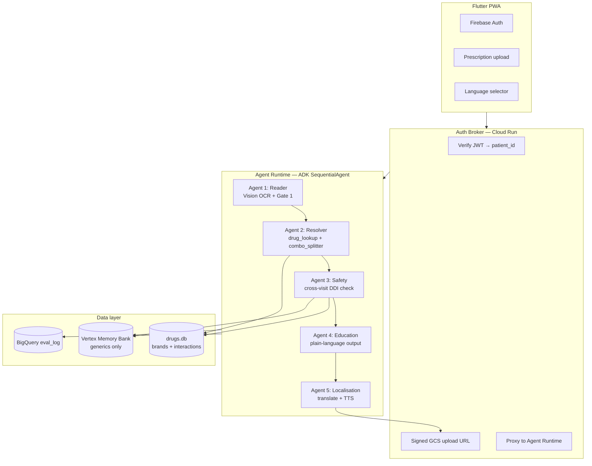

# Architecture diagram (for writeup / video slide)

```mermaid
flowchart TB
    subgraph Client["Flutter PWA"]
        Auth[Firebase Auth]
        Upload[Prescription upload]
        Lang[Language selector]
    end

    subgraph Broker["Auth Broker — Cloud Run"]
        JWT[Verify JWT → patient_id]
        GCS[Signed GCS upload URL]
        Proxy[Proxy to Agent Runtime]
    end

    subgraph Runtime["Agent Runtime — ADK SequentialAgent"]
        A1[Agent 1: Reader\nVision OCR + Gate 1]
        A2[Agent 2: Resolver\ndrug_lookup + combo_splitter]
        A3[Agent 3: Safety\ncross-visit DDI check]
        A4[Agent 4: Education\nplain-language output]
        A5[Agent 5: Localisation\ntranslate + TTS]
        A1 --> A2 --> A3 --> A4 --> A5
    end

    subgraph Data["Data layer"]
        DB[(drugs.db\nbrands + interactions)]
        MEM[(Vertex Memory Bank\ngenerics only)]
        BQ[(BigQuery eval_log)]
    end

    Client --> Broker --> Runtime
    A2 --> DB
    A3 --> DB
    A3 --> MEM
    A5 --> GCS
    Runtime --> MEM
    Runtime --> BQ
```

**Export tip:** Paste into [mermaid.live](https://mermaid.live) and export PNG for the Media Gallery.
