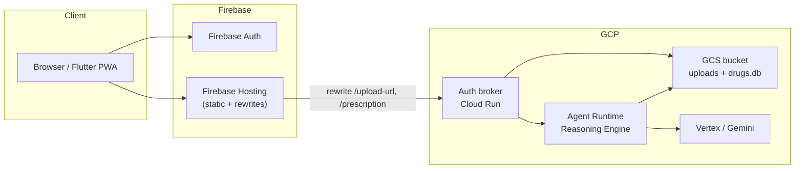

# Manual smoke test cheat sheet

Incremental manual checks from **backend-only** → **Flutter local** → **full cloud E2E**.
For deploy commands, see [deployment_runbook.md](deployment_runbook.md).

---

## Test prescription image

The runbook references `data/sample/prescription.jpg`, but **no sample image is committed**
(privacy). Use any readable prescription photo (JPEG/PNG):

```bash
# Set once per shell — point at your image
export RX_IMAGE=~/Downloads/my-prescription.jpg   # or add data/sample/prescription.jpg locally
```

Requirements: legible drug names, &lt; 8 MB, formats `jpg|png|webp|heic`.

---

## Shared one-time setup (all cloud scenarios)

From [runbook §0–§1](deployment_runbook.md):

```bash
export GCP_PROJECT=medication-companion-dev
export GCP_REGION=us-central1

gcloud auth login
gcloud auth application-default login
uv sync

# Once per GCP project
make infra-apply GCP_PROJECT=$GCP_PROJECT
gcloud storage cp data/drugs.db gs://$GCP_PROJECT-uploads/artifacts/drugs.db
cd frontend && flutterfire configure --project=$GCP_PROJECT
```

---

## Architecture (cloud)



**Local dev shortcut:** Flutter or `test_prescription.py` → `localhost:8080` broker → either
**local ADK Runner** (A1) or **remote Agent Runtime** (B2).

---

## Scenario ladder

| ID | What runs locally | What runs in GCP | Primary tool | Validates |
|----|-------------------|------------------|--------------|-----------|
| **A1** | Auth broker + ADK pipeline | Gemini, GCS bucket | `test_prescription.py` | Full pipeline code, GCS upload, broker HTTP |
| **A2** | `agents-cli playground` or pytest | Gemini (via API) | playground / pytest | Agent wiring only — **not** deployed Runtime revision |
| **A3** | `test_prescription.py` | Agent Runtime + broker + GCS + Auth | script → Hosting URL | Backend HTTP path + Firebase JWT + remote Runtime |
| **B1** | Flutter + broker + local Runner | Gemini, GCS | `flutter run` | Flutter UI + same stack as A1 |
| **B2** | Flutter + broker | Agent Runtime + GCS + Gemini | `flutter run` + env | Flutter UI against **deployed** Runtime |
| **C** | Browser only | Everything | Hosted PWA | Full prod path incl. Hosting rewrites |

> **Note on “Flutter local → cloud API via Hosting”:** production broker CORS only allows
> `https://<project>.web.app`. A Flutter app on `localhost` calling the Hosting URL will hit
> CORS errors. Use **B2** (local broker → cloud Runtime) for Flutter + cloud agent, or skip
> straight to **C** for true prod E2E.

---

## Deploy before each scenario

| Scenario | Runbook steps required |
|----------|------------------------|
| **A1** | §0 only (ADC + bucket access). **No** `make deploy`. |
| **A2** | §0. Optional: §2 step 1 if you also want `make deploy-status` on a live Runtime. |
| **A3** | §0 + §1 + **§2** (`make deploy-backend`). Hosting optional if you hit broker via Hosting URL. |
| **B1** | Same as A1. |
| **B2** | Same as A3 (need deployed Agent Runtime + `deployment_metadata.json`). |
| **C** | §0 + §1 + **§2 + §3** (`make deploy-backend` then `make deploy-frontend`). |

Quick deploy reference:

```bash
# §2 — Agent Runtime + auth broker
make deploy-backend GCP_PROJECT=$GCP_PROJECT GCP_REGION=$GCP_REGION

# §3 — Flutter PWA on Hosting
make deploy-frontend GCP_PROJECT=$GCP_PROJECT
```

---

## A — Backend smoke tests (no Flutter UI)

### A1 · Local broker + local ADK Runner

**Tests:** broker, all 5 agents, drug tools, GCS (cloud bucket), Gemini (cloud API).

```bash
export ENVIRONMENT=local
export DEV_PATIENT_ID=dev-patient-001
export USE_LOCAL_RUNNER=true
export GCS_BUCKET=${GCP_PROJECT}-uploads
export GOOGLE_CLOUD_PROJECT=$GCP_PROJECT

# Terminal 1
make local-auth-broker

# Terminal 2
curl -s http://localhost:8080/health | jq .

uv run python scripts/test_prescription.py "$RX_IMAGE" \
  --url http://localhost:8080
```

**Pass:** HTTP 200, JSON with `resolved_drugs`, `overall_severity`, disclaimer text.
Script auto-falls back to `/upload-direct` if signed URLs fail locally.

**Optional — agent-only (no broker/GCS):**

```bash
make playground          # agents-cli interactive UI
# or
uv run pytest tests/integration/test_agent.py -m live -q
```

---

### A2 · Deployed Agent Runtime (no auth broker HTTP)

**Tests:** Runtime deploy succeeded. Does **not** exercise upload URL, JWT, or Flutter.

```bash
make deploy-prep GCP_PROJECT=$GCP_PROJECT
make deploy GCP_PROJECT=$GCP_PROJECT GCP_REGION=$GCP_REGION
make deploy-status GCP_PROJECT=$GCP_PROJECT
make grant-tts-iam GCP_PROJECT=$GCP_PROJECT   # first time only
```

**Pass:** `deploy-status` shows a healthy reasoning engine; `deployment_metadata.json`
contains `remote_agent_runtime_id`.

**Limitation:** There is no first-class “upload a JPEG to Runtime” HTTP API — the broker
is the HTTP façade. For pipeline behaviour without the broker, use A1 playground/pytest.
For the **deployed** revision, use A3 or B2.

---

### A3 · Cloud Agent Runtime + cloud auth broker

**Tests:** Firebase JWT, signed GCS PUT, broker → Runtime, full backend path (no Flutter UI).

**Deploy:** runbook §2 (`make deploy-backend`).

```bash
# Health (no auth)
curl -s https://$GCP_PROJECT.web.app/health | jq .

# Full pipeline — needs a Firebase ID token (Email/Password user in Console)
export FIREBASE_ID_TOKEN="<from browser DevTools after sign-in on hosted app>"

uv run python scripts/test_prescription.py "$RX_IMAGE" \
  --url https://$GCP_PROJECT.web.app \
  --token "$FIREBASE_ID_TOKEN"
```

**Get a token quickly:** sign in at `https://$GCP_PROJECT.web.app`, open DevTools →
Application → look at network request `Authorization` header, or console:

```javascript
// after sign-in on the hosted app
firebase.auth().currentUser.getIdToken().then(console.log)
```

**Pass:** same JSON shape as A1; Cloud Run logs show `Running pipeline via Agent Runtime`.

---

## B — Flutter local, backend varies

Flutter defaults (`frontend/lib/config.dart`): `API_BASE_URL=http://localhost:8080`,
`ENVIRONMENT=local` → dev-mode login bypass, `/upload-direct` fallback.

### B1 · Flutter + local broker + local Runner

Same backend as **A1**. Deploy: none beyond §0.

```bash
# Terminal 1 — same env as A1
make local-auth-broker

# Terminal 2
cd frontend && flutter run -d chrome
```

**Pass:** “Continue in dev mode” → upload image → results screen with drugs/interactions.

---

### B2 · Flutter local + local broker + cloud Agent Runtime

**Tests:** Flutter UI against the **deployed** Runtime (broker still local for CORS).

**Deploy:** runbook §2 (`make deploy-backend`).

```bash
export ENVIRONMENT=local
export DEV_PATIENT_ID=dev-patient-001
export USE_LOCAL_RUNNER=false          # ← use remote Runtime
export GCS_BUCKET=${GCP_PROJECT}-uploads
export GOOGLE_CLOUD_PROJECT=$GCP_PROJECT
# AGENT_RUNTIME_RESOURCE picked up from deployment_metadata.json automatically
# when running from repo root; or set explicitly:
# export AGENT_RUNTIME_RESOURCE=$(python3 -c "import json; print(json.load(open('deployment_metadata.json'))['remote_agent_runtime_id'])")

make local-auth-broker

cd frontend && flutter run -d chrome
```

**Pass:** same UI as B1; broker logs say `Running pipeline via Agent Runtime`.

---

## C · Full cloud E2E

**Tests:** Hosting static assets, rewrites, Firebase Auth, broker, Runtime, GCS — everything.

**Deploy:** runbook §2 + §3.

```bash
make deploy-backend GCP_PROJECT=$GCP_PROJECT
make deploy-frontend GCP_PROJECT=$GCP_PROJECT
```

1. Open `https://$GCP_PROJECT.web.app`
2. Create account / sign in (Firebase Email/Password)
3. Upload `$RX_IMAGE`
4. Confirm results + “Please discuss this with your doctor or pharmacist.” on strings

**Quick backend-only check (same as A3):** `curl …/health` + `test_prescription.py` with token.

---

## Pass / fail checklist (all scenarios)

| Check | A1 | A2 | A3 | B1 | B2 | C |
|-------|:--:|:--:|:--:|:--:|:--:|:--:|
| `/health` 200 | ✓ | — | ✓ | ✓ | ✓ | ✓ |
| GCS upload works | ✓ | — | ✓ | ✓ | ✓ | ✓ |
| Pipeline returns drugs | ✓ | partial | ✓ | ✓ | ✓ | ✓ |
| Firebase JWT enforced | — | — | ✓ | — | — | ✓ |
| Hosting rewrites | — | — | ✓ | — | — | ✓ |
| Flutter UI | — | — | — | ✓ | ✓ | ✓ |
| Deployed Runtime revision | — | status | ✓ | — | ✓ | ✓ |

---

## When something fails

See [runbook §8](deployment_runbook.md#8-troubleshooting-one-liners) and
[forensic_prompts.md](forensic_prompts.md).

| Symptom | Scenario | First check |
|---------|----------|-------------|
| 403 on `/health` via Hosting | A3, C | Re-run `make deploy-auth-broker` (public invoke) |
| 500 on `/upload-url` “private key” | A3, C | Re-run `make deploy-auth-broker` (signBlob fix in `gcs.py`) |
| CORS error from Flutter localhost | B → Hosting URL | Use B2 (local broker) instead |
| Empty / timeout pipeline | A1, B1 | ADC: `gcloud auth application-default login` |
| 500 on `/prescription` | A3, B2, C | `make deploy-auth-broker` (refresh Runtime ID) |
