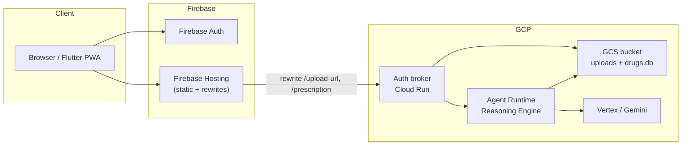

# Manual smoke test cheat sheet

Incremental manual checks from **backend-only** → **Flutter local** → **full cloud E2E**.
For deploy commands, see [deployment_runbook.md](deployment_runbook.md).

---

## Test prescription image

**Deterministic fixture (committed):** `data/sample/smoke_4drug_2interactions.png` — four
curated Indian brands with **three known HIGH interactions** in `data/drugs.db`:

| Brand on Rx | Generic | Interaction |
|-------------|---------|-------------|
| Ecosprin | aspirin | aspirin + nimesulide → **HIGH** |
| Nise | nimesulide | (same pair) |
| Warf | warfarin | aspirin + warfarin → **HIGH** (curated) |
| Flagyl | metronidazole | metronidazole + warfarin → **HIGH** |

Within-visit pair count: **6** (= C(4,2)). Expected interactions from dataset: **3**.

Regenerate the PNG: `uv pip install pillow && uv run python scripts/generate_smoke_prescription.py`

Offline sanity check (no Gemini):

```bash
uv run python scripts/verify_smoke_fixture.py
```

For ad-hoc photos, use any readable prescription (JPEG/PNG):

```bash
export RX_IMAGE=data/sample/smoke_4drug_2interactions.png   # or ~/Downloads/my-rx.jpg
```

Requirements: legible drug names, &lt; 8 MB, formats `jpg|png|webp|heic`.

**Standard prompt** (include `Target language:` for Agent 5):

```text
Please analyse this prescription image. Target language: en-IN
```

---

## Quick copy-paste paths

| Goal | Scenario | One command block |
|------|----------|-------------------|
| Fastest local full HTTP JSON | **A1** | `USE_LOCAL_RUNNER=true` + `test_prescription.py` → [A1](#a1--local-broker--local-adk-runner) |
| Deployed Runtime + per-agent trace | **A2b** | `agents-cli run --url … --file` → [A2b](#a2b--deployed-agent-runtime-smoke-agents-cli-run--recommended) |
| Deployed Runtime + HTTP JSON | **A2b-broker** | `USE_LOCAL_RUNNER=false` + `test_prescription.py` → [A2b-broker](#a2b-broker--local-broker--deployed-runtime-prescriptionresult-json) |
| Prod path + Firebase | **A3 / C** | Hosted URL + JWT → [A3](#a3--cloud-agent-runtime--cloud-auth-broker) |

---

## Shared one-time setup (all cloud scenarios)

From [runbook §0–§1](deployment_runbook.md):

```bash
export GCP_PROJECT=medication-companion-dev
export GCP_REGION=us-central1

gcloud auth login
gcloud auth application-default login
uv sync

# Once per GCP project
make infra-apply GCP_PROJECT=$GCP_PROJECT
# Terraform default bucket (NOT ${GCP_PROJECT}-uploads)
gcloud storage cp data/drugs.db gs://medication-companion-uploads/artifacts/drugs.db
cd frontend && flutterfire configure --project=$GCP_PROJECT
```

---

## Architecture (cloud)



**Local dev shortcut:** Flutter or `test_prescription.py` → `localhost:8080` broker → either
**local ADK Runner** (A1) or **remote Agent Runtime** (B2).

---

## Scenario ladder

| ID | What runs locally | What runs in GCP | Primary tool | Validates |
|----|-------------------|------------------|--------------|-----------|
| **A1** | Auth broker + ADK pipeline | Gemini, GCS bucket | `test_prescription.py` | Full pipeline code, GCS upload, broker HTTP |
| **A2** | `make playground` or pytest | Gemini (via API) | ADK web UI / pytest | Agent wiring only — **not** deployed Runtime revision |
| **A2b** | `agents-cli run` (CLI) | Deployed Agent Runtime + GCS + Gemini | `agents-cli run --url … --file` | Same revision as prod; vision + safety + cloud TTS |
| **A2b-broker** | `test_prescription.py` + local broker | Agent Runtime + broker assembly | script, `USE_LOCAL_RUNNER=false` | Same as A2b but **PrescriptionResult** JSON via HTTP |
| **A3** | `test_prescription.py` | Agent Runtime + broker + GCS + Auth | script → Hosting URL | Backend HTTP path + Firebase JWT + remote Runtime |
| **B1** | Flutter + broker + local Runner | Gemini, GCS | `flutter run` | Flutter UI + same stack as A1 |
| **B2** | Flutter + broker | Agent Runtime + GCS + Gemini | `flutter run` + env | Flutter UI against **deployed** Runtime |
| **C** | Browser only | Everything | Hosted PWA | Full prod path incl. Hosting rewrites |

> **Note on “Flutter local → cloud API via Hosting”:** production broker CORS only allows
> `https://<project>.web.app`. A Flutter app on `localhost` calling the Hosting URL will hit
> CORS errors. Use **B2** (local broker → cloud Runtime) for Flutter + cloud agent, or skip
> straight to **C** for true prod E2E.

---

## Deploy before each scenario

| Scenario | Runbook steps required |
|----------|------------------------|
| **A1** | §0 only (ADC + bucket access). **No** `make deploy`. |
| **A2** | §0. Optional: §2 step 1 if you also want `make deploy-status` on a live Runtime. |
| **A2b** | §0 + **§2 step 1 only** (`make deploy` + `deploy-status`). No auth broker or Hosting. |
| **A2b-broker** | Same as A2b + local broker running (no `deploy-auth-broker` required if broker code unchanged). |
| **A3** | §0 + §1 + **§2** (`make deploy-backend`). Hosting optional if you hit broker via Hosting URL. |
| **B1** | Same as A1. |
| **B2** | Same as A3 (need deployed Agent Runtime + `deployment_metadata.json`). |
| **C** | §0 + §1 + **§2 + §3** (`make deploy-backend` then `make deploy-frontend`). |

Quick deploy reference:

```bash
# §2 — Agent Runtime + auth broker
make deploy-backend GCP_PROJECT=$GCP_PROJECT GCP_REGION=$GCP_REGION

# §3 — Flutter PWA on Hosting
make deploy-frontend GCP_PROJECT=$GCP_PROJECT
```

---

## A — Backend smoke tests (no Flutter UI)

### A1 · Local broker + local ADK Runner

**Tests:** broker, all 5 agents, drug tools, GCS (cloud bucket), Gemini (cloud API).

```bash
export ENVIRONMENT=local
export DEV_PATIENT_ID=dev-patient-001
export USE_LOCAL_RUNNER=true
export GCS_BUCKET=medication-companion-uploads
export GOOGLE_CLOUD_PROJECT=$GCP_PROJECT

# Terminal 1
make local-auth-broker

# Terminal 2
curl -s http://localhost:8080/health | jq .

export RX_IMAGE=data/sample/smoke_4drug_2interactions.png

uv run python scripts/test_prescription.py "$RX_IMAGE" \
  --url http://localhost:8080 --upload-mode direct
```

**Pass:** HTTP 200, JSON with `resolved_drugs`, `overall_severity`, disclaimer text.
Script auto-falls back to `/upload-direct` if signed URLs fail locally.

**Verify deterministic safety (Agent 3):**

1. **Broker terminal** — after `/prescription`, grep for:

   ```text
   INFO:tools.safety_check:Safety check for patient dev-patient-001: 4 generic(s), 6 pair(s) checked, 3 interaction(s) from dataset
   ```

   If you see `No resolved generics in session state`, Agent 2 did not write
   `resolved_drugs` (often allowlist mismatch — Agent 1 OCR names must match resolver
   `raw_name`). Re-run with the committed fixture above.

2. **Script summary** — footer should show 4 drugs and 3 interactions:

   ```text
   Severity   : HIGH
   Drugs      : 4 resolved
   Interactions: 3
   ```

3. **Offline baseline** (before hitting Gemini): `uv run python scripts/verify_smoke_fixture.py`

`pairs_checked` is logged by `tools.safety_check` but is **not** in the HTTP JSON today
(the LLM copies only `interactions` / `overall_severity` into the API response).

**Optional — local ADK web UI (local code, not deployed Runtime):**

```bash
export GOOGLE_CLOUD_PROJECT=$GCP_PROJECT
export MEMORY_BACKEND=local
make playground
# Open http://localhost:8000?userId=playground-smoke-001
# Attach $RX_IMAGE via the UI file picker, then send the prompt below.
```

Or: `uv run pytest tests/integration/test_agent.py -m live -q`

---

### A2 · Deployed Agent Runtime (no auth broker HTTP)

**Tests:** Runtime deploy succeeded. Does **not** exercise upload URL, JWT, or Flutter.

```bash
make deploy-prep GCP_PROJECT=$GCP_PROJECT
make deploy GCP_PROJECT=$GCP_PROJECT GCP_REGION=$GCP_REGION
make deploy-status GCP_PROJECT=$GCP_PROJECT
make grant-tts-iam GCP_PROJECT=$GCP_PROJECT   # first time only
```

**Pass:** `deploy-status` shows a healthy reasoning engine; `deployment_metadata.json`
contains `remote_agent_runtime_id`.

**Limitation:** There is no first-class “upload a JPEG to Runtime” HTTP API — the broker
is the HTTP façade. For the **deployed** revision with an image, use **A2b** (`agents-cli run`)
or **A2b-broker** (`test_prescription.py` + `USE_LOCAL_RUNNER=false`).

---

### A2b · Deployed Agent Runtime smoke (`agents-cli run`) — **recommended**

**Tests:** the **live** Reasoning Engine revision — full 5-agent pipeline, vision on the
fixture image, deterministic safety, Agent 5 localisation + **real cloud TTS** — without
Firebase JWT or Hosting.

**Deploy:** runbook §2 step 1 only (`make deploy` + `deploy-status`).

```bash
export GCP_PROJECT=medication-companion-dev
export GOOGLE_CLOUD_PROJECT=$GCP_PROJECT
export RX_IMAGE=data/sample/smoke_4drug_2interactions.png

# Optional offline check (no Gemini)
uv run python scripts/verify_smoke_fixture.py

# Base Reasoning Engine URL from deployment_metadata.json
# IMPORTANT: do NOT append :streamQuery — agents-cli adds :query / :streamQuery itself
export RUNTIME_URL=$(python3 -c "
import json
resource = json.load(open('deployment_metadata.json'))['remote_agent_runtime_id']
print(f'https://us-central1-aiplatform.googleapis.com/v1/{resource}')
")

agents-cli run \
  --url "$RUNTIME_URL" \
  --mode adk \
  --file "$RX_IMAGE" \
  "Please analyse this prescription image. Target language: hi-IN"
```

**Prompt** (change language code as needed):

```text
Please analyse this prescription image. Target language: en-IN
```

Supported: `en-IN`, `hi-IN`, `ta-IN`, `te-IN`, `bn-IN`.

#### Pass (fixture)

| Step | Expected |
|------|----------|
| **prescription_reader** | `Ecosprin`, `Nise`, `Warf`, `Flagyl` |
| **medication_resolver** | `aspirin`, `nimesulide`, `warfarin`, `metronidazole` |
| **medication_safety** | 3 × **HIGH**: `aspirin+nimesulide`, `aspirin+warfarin`, `metronidazole+warfarin` |
| **patient_education** | `interaction_cards` use same generic pairs |
| **localisation_audio** | Non-English text for `hi-IN`; `audio_url` is a **real** `storage.googleapis.com/…` signed URL (not `stub.local`) |

Resume a session: add `--session-id <id>` (printed at end of a prior run).

#### Common mistakes

| Mistake | Symptom |
|---------|---------|
| `--url …:streamQuery` | `HTTP 400` — `Resource name invalid …:streamQuery` |
| Paste `gs://…` in message text only | Agent 1 hallucinates unrelated drugs (e.g. Metformin, Lisinopril) |
| Use Vertex **Console** playground text box | Often **no image attach**; same hallucination risk — use this CLI flow instead |

#### Console playground (optional, limited)

The Vertex Agent Engine **Console** playground link (from `make deploy` or
`deployment_metadata.json`) is useful for **text-only** traces and deploy health checks.
It generally does **not** expose a reliable image-upload control for this agent.
Do **not** use it as the primary prescription-image smoke test.

---

### A2b-broker · Local broker → deployed Runtime (`PrescriptionResult` JSON)

Same deployed Runtime as A2b, but through the auth broker so you get the same HTTP JSON
shape as **A1** (including `interactions` assembled from the safety tool).

```bash
export GCP_PROJECT=medication-companion-dev
export GOOGLE_CLOUD_PROJECT=$GCP_PROJECT
export ENVIRONMENT=local
export DEV_PATIENT_ID=playground-smoke-001
export USE_LOCAL_RUNNER=false          # broker calls remote Agent Runtime
export GCS_BUCKET=medication-companion-uploads
export RX_IMAGE=data/sample/smoke_4drug_2interactions.png

# Terminal 1
make local-auth-broker

# Terminal 2
uv run python scripts/test_prescription.py "$RX_IMAGE" \
  --url http://localhost:8080 \
  --upload-mode direct \
  --language hi-IN
```

**Pass:** HTTP 200; footer shows 4 drugs, 3 interactions, `Severity: HIGH`.
Broker log: `Running pipeline via Agent Runtime` (not `local ADK Runner`).

**Memory smoke (2nd run):** reuse `DEV_PATIENT_ID=playground-smoke-001`, upload a Rx that
interacts with drugs from the first visit; Agent 3 should emit a `cross_visit` interaction.

**Verify Memory Bank write (after deploy):**

```bash
uv run python scripts/inspect_memory_bank.py --patient-id YOUR_FIREBASE_UID
```

**Pass (run 1):** `Parsed visit records: 1`. Cloud Logging: `Saved visit to memory for patient …`.
**Pass (run 2):** `Preloaded N prior generic(s) from 1 visit(s)` and `N prior generic(s) in memory` in safety check log.

#### Fail / limits (A2b / A2b-broker)

- Does **not** test Firebase JWT, signed upload URLs via Hosting, or Flutter UI → use **A3** or **C**.
- `agents-cli run` prints per-agent JSON, not a single `PrescriptionResult` → use **A2b-broker** for API shape.

---

### A3 · Cloud Agent Runtime + cloud auth broker

**Tests:** Firebase JWT, signed GCS PUT, broker → Runtime, full backend path (no Flutter UI).

**Deploy:** runbook §2 (`make deploy-backend`).

```bash
# Health (no auth)
curl -s https://$GCP_PROJECT.web.app/health | jq .

# Full pipeline — needs a Firebase ID token (Email/Password user in Console)
export FIREBASE_ID_TOKEN="<from browser DevTools after sign-in on hosted app>"

uv run python scripts/test_prescription.py "$RX_IMAGE" \
  --url https://$GCP_PROJECT.web.app \
  --token "$FIREBASE_ID_TOKEN"
```

**Get a token quickly:** sign in at `https://$GCP_PROJECT.web.app`, open DevTools →
Application → look at network request `Authorization` header, or console:

```javascript
// after sign-in on the hosted app
firebase.auth().currentUser.getIdToken().then(console.log)
```

**Pass:** same JSON shape as A1; Cloud Run logs show `Running pipeline via Agent Runtime`.

---

## B — Flutter local, backend varies

Flutter defaults (`frontend/lib/config.dart`): `API_BASE_URL=http://localhost:8080`,
`ENVIRONMENT=local` → dev-mode login bypass, `/upload-direct` fallback.

### B1 · Flutter + local broker + local Runner

Same backend as **A1**. Deploy: none beyond §0.

```bash
# Terminal 1 — same env as A1
make local-auth-broker

# Terminal 2
cd frontend && flutter run -d chrome
```

**Pass:** “Continue in dev mode” → upload image → results screen with drugs/interactions.

---

### B2 · Flutter local + local broker + cloud Agent Runtime

**Tests:** Flutter UI against the **deployed** Runtime (broker still local for CORS).

**Deploy:** runbook §2 (`make deploy-backend`).

```bash
export ENVIRONMENT=local
export DEV_PATIENT_ID=dev-patient-001
export USE_LOCAL_RUNNER=false          # ← use remote Runtime
export GCS_BUCKET=medication-companion-uploads
export GOOGLE_CLOUD_PROJECT=$GCP_PROJECT
# AGENT_RUNTIME_RESOURCE picked up from deployment_metadata.json automatically
# when running from repo root; or set explicitly:
# export AGENT_RUNTIME_RESOURCE=$(python3 -c "import json; print(json.load(open('deployment_metadata.json'))['remote_agent_runtime_id'])")

make local-auth-broker

cd frontend && flutter run -d chrome
```

**Pass:** same UI as B1; broker logs say `Running pipeline via Agent Runtime`.

---

## C · Full cloud E2E

**Tests:** Hosting static assets, rewrites, Firebase Auth, broker, Runtime, GCS — everything.

**Deploy:** runbook §2 + §3.

```bash
make deploy-backend GCP_PROJECT=$GCP_PROJECT
make deploy-frontend GCP_PROJECT=$GCP_PROJECT
```

1. Open `https://$GCP_PROJECT.web.app`
2. Create account / sign in (Firebase Email/Password)
3. Upload `$RX_IMAGE`
4. Confirm results + “Please discuss this with your doctor or pharmacist.” on strings

**Quick backend-only check (same as A3):** `curl …/health` + `test_prescription.py` with token.

---

## Day 4 eval + observability verification (after code changes)

Three incremental checks — run in order.

### Step 1 · Eval dataset (no Gemini)

**Important:** `agents-cli eval generate` hits deployed Agent Runtime. Agent 1 expects
prescription images as **`gs://` `file_data`** (same as production). `inline_data` base64 in
the JSON dataset is stored but usually **does not reach vision** on Runtime — Agent 1 then
returns `gate1_reject` / "image not transmitted", and `drug_safety_score` on the smoke case
scores 0 even though `agents-cli run --file` works fine.

Upload the smoke fixture once, then rebuild the dataset with a GCS URI:

```bash
export GCS_BUCKET=medication-companion-uploads
gsutil cp data/sample/smoke_4drug_2interactions.png \
  gs://${GCS_BUCKET}/eval/smoke_4drug_2interactions.png

uv run python scripts/build_smoke_eval_dataset.py \
  --gcs-uri gs://${GCS_BUCKET}/eval/smoke_4drug_2interactions.png

python3 -c "
import json
d=json.load(open('tests/eval/datasets/basic-dataset.json'))
ids=[c['eval_case_id'] for c in d['eval_cases']]
assert 'smoke_4drug_2interactions' in ids, ids
smoke=next(c for c in d['eval_cases'] if c['eval_case_id']=='smoke_4drug_2interactions')
part=smoke['prompt']['parts'][1]
assert 'file_data' in part, part.keys()
print('OK:', ids, 'image=', part['file_data']['file_uri'])
"
```

### Step 2 · Custom metrics eval (`drug_safety_score`, `patient_clarity_score`)

Requires deployed Runtime (A2 deploy) and ADC. Uses **`tests/eval/eval_config.yaml`**
— not the platform auto-rubrics (`Agent Tool Use Quality`, `Agent Final Response Quality`)
shown when you grade an existing session in the UI.

The rubric grades **only** what `check_prescription_interactions` returned in the trace
(dataset-backed). It does not apply external pharmacology beyond the tool output.

#### Step 2a · Vision eval via production path (**recommended**)

`agents-cli eval generate` often fails to deliver prescription images to Agent 1 on
Runtime (Gate 1 reject / "image not transmitted"). Use the production GCS +
`streamQuery` path instead: run the pipeline, export one trace, grade that file.

**Prerequisites:** Step 1 upload complete; `deployment_metadata.json` has
`remote_agent_runtime_id`; ADC configured (`gcloud auth application-default login`).

```bash
export GCP_PROJECT=medication-companion-dev
export GOOGLE_CLOUD_PROJECT=$GCP_PROJECT

# One command: Runtime inference → trace JSON → custom metrics grade
uv run python scripts/run_vision_eval_trace.py --skip-upload --grade

open artifacts/grade_results/results_*.html
```

**What the script does**

1. Uses `gs://medication-companion-uploads/eval/smoke_4drug_2interactions.png` (from Step 1)
2. Calls `run_prescription_pipeline` (same path as auth broker / A2b-broker)
3. Writes `artifacts/traces/vision_eval_<timestamp>.json` (single case)
4. Runs `agents-cli eval grade --config tests/eval/eval_config.yaml --traces <that file>`

**Variants**

```bash
# Trace only (grade later against a specific file)
uv run python scripts/run_vision_eval_trace.py --skip-upload

agents-cli eval grade \
  --config tests/eval/eval_config.yaml \
  --traces artifacts/traces/vision_eval_<timestamp>.json

# Upload a local image to GCS first, then run + grade
uv run python scripts/run_vision_eval_trace.py \
  --image data/sample/smoke_4drug_2interactions.png --grade

# Reuse an existing gs:// object
uv run python scripts/run_vision_eval_trace.py \
  --gcs-uri gs://medication-companion-uploads/eval/smoke_4drug_2interactions.png \
  --grade
```

**Pass (smoke case):**

- Console: `Gate 1 ok — pairs_checked=6, interactions=3, severity=HIGH`
- HTML: one row for `smoke_4drug_2interactions`; `drug_safety_score` ≥ 8;
  `patient_clarity_score` ≥ 8
- Grade **one** trace file — do not pass `--traces artifacts/traces/` (old runs duplicate rows)

**Sanity check without eval:** `agents-cli run --url "$RUNTIME_URL" --mode adk --file "$RX_IMAGE" …`
([A2b](#a2b--deployed-agent-runtime-smoke-agents-cli-run--recommended)).

#### Step 2b · Dataset `eval generate` (optional; vision often broken on Runtime)

```bash
export GCP_PROJECT=medication-companion-dev
export GOOGLE_CLOUD_PROJECT=$GCP_PROJECT

# Generate traces (inference) → artifacts/traces/traces_<timestamp>.json
agents-cli eval generate --dataset tests/eval/datasets/basic-dataset.json

# Grade with repo custom metrics only — pass ONE trace file, not the whole folder
agents-cli eval grade \
  --config tests/eval/eval_config.yaml \
  --traces artifacts/traces/traces_<timestamp>.json

open artifacts/grade_results/results_*.html
```

**Pass:** HTML report lists **`drug_safety_score`** and **`patient_clarity_score`** per case.
Smoke case: safety ≥ 8 when Agent 1 reads the image (3 dataset interactions reflected).
Blurry GIF case: safety 10 (correct Gate 1 handling). If smoke scores 0 with Gate 1 reject,
use Step 2a instead — `inline_data` / eval-generate vision delivery is unreliable on Runtime.

**Offline baseline before any eval:** `uv run python scripts/verify_smoke_fixture.py`
(expect 6 pairs, 3 interactions, HIGH).

### Step 3 · Runtime async judge + span attributes (after redeploy)

Redeploy, then run A2b or A2b-broker. Check Cloud Logging for:

```text
Scheduled async pipeline eval (session=…)
Pipeline eval complete (session=… safety=… clarity=…)
```

Optional BigQuery (when `GOOGLE_CLOUD_PROJECT` + `medication_companion.eval_log` exist):

```bash
bq query --use_legacy_sql=false \
  'SELECT session_id, safety_score, clarity_score, timestamp
   FROM `medication-companion-dev.medication_companion.eval_log`
   ORDER BY timestamp DESC LIMIT 5'
```

**Traces:** Cloud Console → Agent Platform → **Traces** → open a span → attributes include
`policy_decision`, `patient_id_hash`, and (on Agent 1) `image_classification`.

**Note:** The **Memories** tab tracks platform memory-generation metrics, not custom
`VertexAiMemoryBankService.add_memory()` writes — use broker memory smoke (A2b-broker §) instead.

---

## Pass / fail checklist (all scenarios)

| Check | A1 | A2 | A2b | A2b-broker | A3 | B1 | B2 | C |
|-------|:--:|:--:|:---:|:----------:|:--:|:--:|:--:|:--:|
| `/health` 200 | ✓ | — | — | ✓ | ✓ | ✓ | ✓ | ✓ |
| GCS upload works | ✓ | — | — | ✓ | ✓ | ✓ | ✓ | ✓ |
| Pipeline returns drugs | ✓ | partial | ✓ | ✓ | ✓ | ✓ | ✓ | ✓ |
| Firebase JWT enforced | — | — | — | — | ✓ | — | — | ✓ |
| Hosting rewrites | — | — | — | — | ✓ | — | — | ✓ |
| Flutter UI | — | — | — | — | — | ✓ | ✓ | ✓ |
| Deployed Runtime revision | — | status | ✓ | ✓ | ✓ | — | ✓ | ✓ |
| PrescriptionResult JSON | ✓ | — | — | ✓ | ✓ | ✓ | ✓ | ✓ |

---

## When something fails

See [runbook §8](deployment_runbook.md#8-troubleshooting-one-liners) and
[forensic_prompts.md](forensic_prompts.md).

| Symptom | Scenario | First check |
|---------|----------|-------------|
| `Resource name invalid …:streamQuery` | A2b | Remove `:streamQuery` from `--url`; use `$RUNTIME_URL` one-liner above |
| Agent 1 returns wrong drugs (Metformin, etc.) | A2b Console / pasted `gs://` | Use `agents-cli run --file "$RX_IMAGE"` — not text-only Console input |
| `No resolved generics in session state` | A1, A2b-broker | Re-run with committed fixture; check broker log for `Safety pre-sync wrote 4` |
| 403 on `/health` via Hosting | A3, C | Re-run `make deploy-auth-broker` (public invoke) |
| 500 on `/upload-url` “private key” | A3, C | Re-run `make deploy-auth-broker` (signBlob fix in `gcs.py`) |
| CORS error from Flutter localhost | B → Hosting URL | Use B2 (local broker) instead |
| Empty / timeout pipeline | A1, B1 | ADC: `gcloud auth application-default login` |
| 500 on `/prescription` | A3, B2, C | `make deploy-auth-broker` (refresh Runtime ID) |
